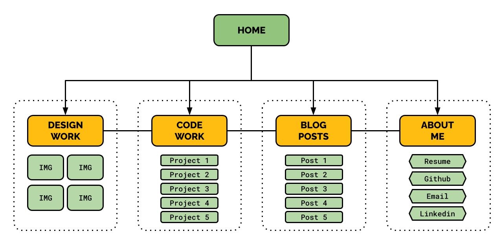
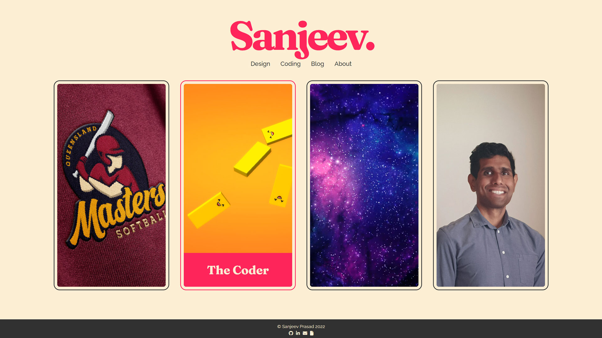
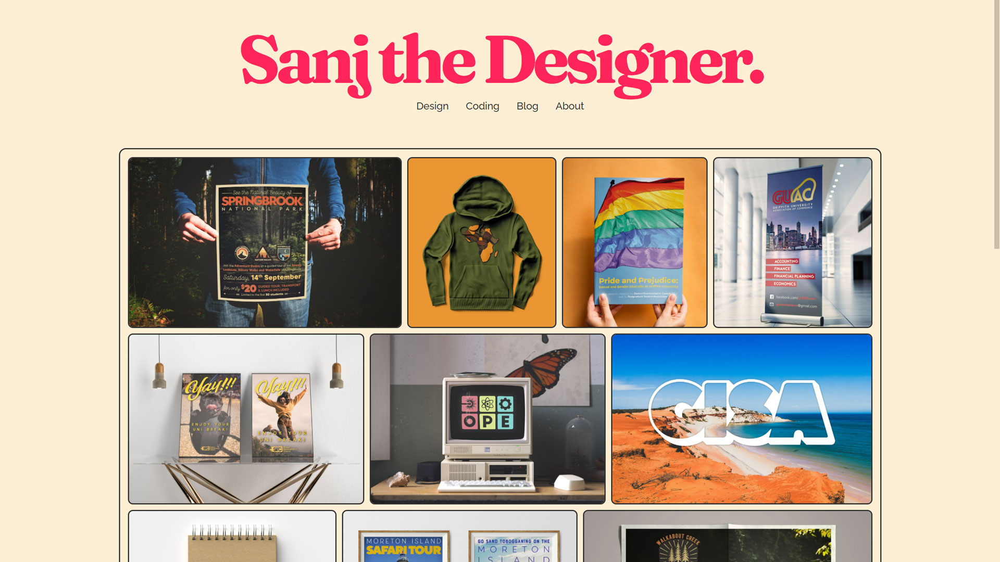
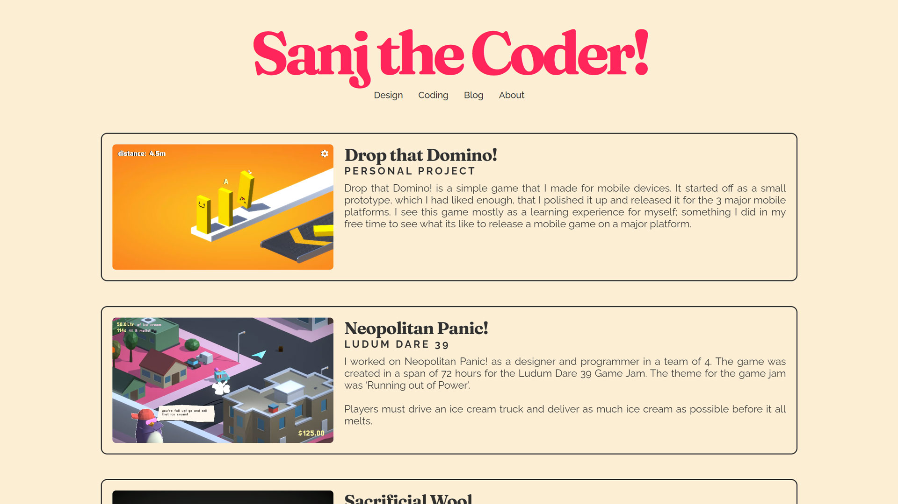
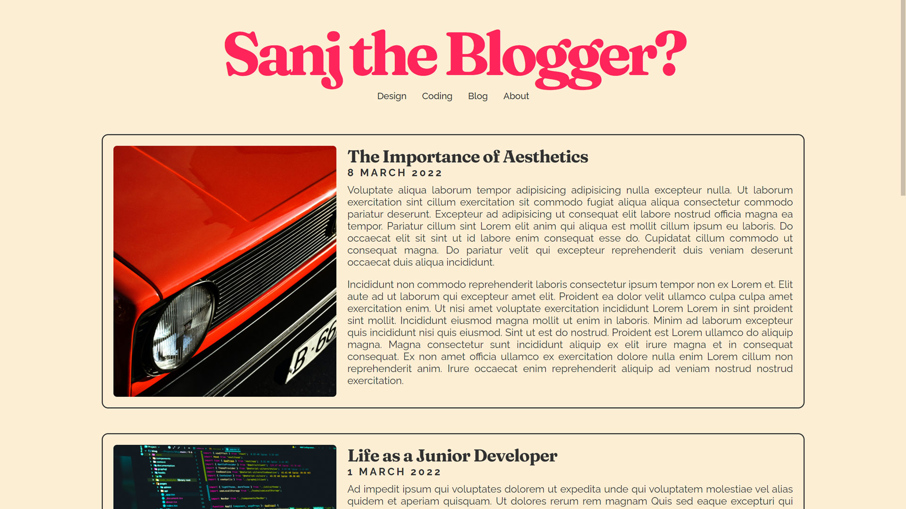
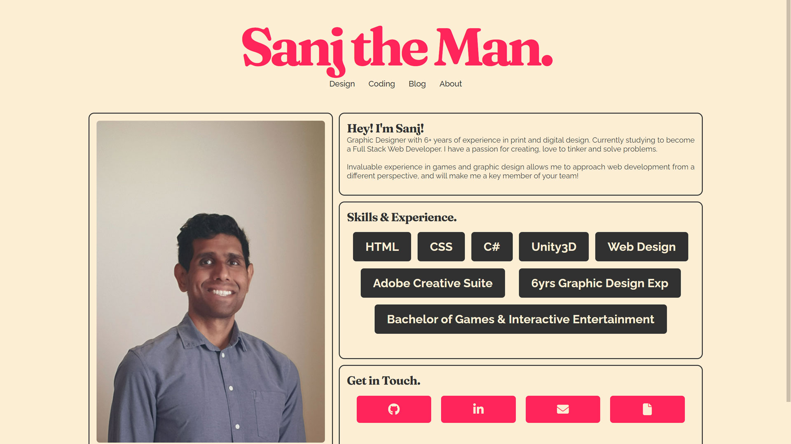

# Sanjeev Prasad T1A2 - Website Portfolio

**Published Portfolio URL:** https://sanjeevprasad-t1a2.netlify.app/

**GitHub Repo:** https://github.com/SanjeevCA/SanjeevPrasad_T1A2/

## Purpose of the Website
To present my work and myself as a future web developer to prospective employers. The website should
showcase my previous **Graphic Design Work**, **Game Development Projects** and any future work I will undertake
as an up and coming full stack web developer. Visitors should also be able to get a sense of who I am
through a **Blog page**, as well as an **About Me page**; with links to get in touch with myself.

## Target Audience
The website will target future employers; those who are looking for a Web Developer/Designer.
## Sitemap

## Functionality / Features / Components
* **Header**
    * Title for each page representing my various roles (Designer/Developer/Blogger)
    * Navigation bar to move between pages
* **Footer**
    * Copyright
    * Social Links
* **Home Page Cards**
    * Preview of my work, serving as portals to those pages/showcases.
* **Design Showcase**
    * Graphic design work displayed in Collage/Masonry format
* **Coding Projects Showcase**
    * Previous Game Projects and Future projects displayed in blog post format
* **Blog Page**
    * Blog Posts displayed in post format
* **About Me page**
    * Brief paragraph about myself
    * Skills and experience tags
    * Contact Links and Resume

## Screenshots
### Homepage

### Design Work

### Coding Work

### Blog Posts

### About Me

## Tech Stack
* **Planning & Presentation**
    * Google Docs *(Sitemap)*
    * [Trello](https://trello.com/) *(Project Management)*
    * [Figma](https://www.figma.com/) *(Wireframes)*
    * [Canva](https://www.canva.com/) *(Slide deck)*
* **Website Development**
    * HTML
    * SASS/CSS
    * Git
    * [Netlify](https://www.netlify.com/) *(website hosting)*
    * [Google Fonts](https://fonts.google.com/) *(fonts)*
    * [Font Awesome](https://fontawesome.com/) *(Social Icons)*
* **Media Assets**
    * My own previous work *(Graphic Design and Games)*
    * [Unsplash](https://unsplash.com/) *(blog post images)*
    * [Envato](https://elements.envato.com/) *(blog card video)*

