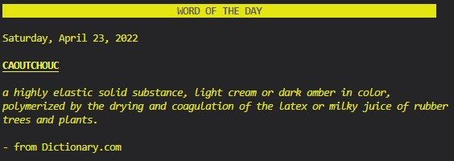

# Sanjeev Prasad T1A3 - Terminal Application

**GitHub Repo:** https://github.com/SanjeevCA/SanjeevPrasad_T1A3/

## Countdown Ruby Application

This application aims to recreate the **Letters Round** from the popular, televised [Countdown Gameshow](https://en.wikipedia.org/wiki/Countdown_(game_show)). The application will be interactive, and allow users to draw letters from a randomly generated pool, and then input a word they wish to play. The application will output the player's score, as well as display the best possible word(s) that could have been played with the drawn letters. The rules for the Countdown Gameshow are quite intricate, and this application aims to replicate those intricacies; see more details in the Feautres section below.

## Coding Style
This application is built using [Ruby](https://www.ruby-lang.org/en/) and adheres to the [Ruby Style Guide](https://rubystyle.guide/). The [RuboCop](https://rubocop.org/) gem was used to keep coding practices in line with the coding style guide. 

## Features

### Drawing Letters

The first part of the game involves drawing random letters from two pools: vowels and consonants. Just like in the game show, certain letters have a higher frequency in the pools than others. The letter pools generated in this application use the frequencies obtianed from this website: http://www.thecountdownpage.com/letters.htm

Players are asked to choose 9 letters, one at a time, and must choose at least 3 vowels and 4 consonants. The feature prevents user errors in choosing letters by auto-selecting letters to ensure the 3 vowels and 4 consonants condition is met.
\
\
\

### Playing a Word

Once the 9 letters are drawn, players can then input a word into the terminal that they wish to play. When a word is played, it's validity is checked on two fronts: First, whether the it is an actual word in the dictionary and spelled correctly. And second, whether the letters used in the played word match with the drawn letters. Special care is taken to ensure no errors occur when inputting special-characters and numbers. 

Players have only 30 seconds to play a word, otherwise they score no points. If an incorrect word is played, the player can try playing another word as long as there is time remaining on their turn. Words are scored a point for each letter used; and score 18 points if all 9 letters are used.
\
\
\

### Dictionary Corner

The Dictionary Corner from the Countdown Gameshow has also been recreated in terminal form! After the player has played a word and been scored, the application will find the best possible word(s) that could have been played with the randomly drawn letters. The application also searches for and displays the definition from [Dictionary.com](https://www.dictionary.com/).

In the case that too many possible words are generated, only a sample of 4 or less will be shown. And measures have been taken to ensure the application works error free in the case where a definition cannot be found, or [Dictionary.com](https://www.dictionary.com/) cannot be reached due to network error.
\
\
\

### Word of the Day (Bonus Feature)

As a bonus feature, the [Word of the Day](https://www.dictionary.com/e/word-of-the-day/) from Dictionary.com can also be displayed on the title screen. The word is updated daily, same as the website, and measures have been taken to handle any network errors. The feature can be accessed by launching the application with the 'wotd' argument.

    $ruby countdown.rb wotd

## Implementation Plan

**Trello Board:** https://trello.com/b/hHZ1L1cy/sanjeevprasadt1a3

The development of this application was first planned out and tracked using a Trello board as seen below. Certain features that were planned for did not get implemented as was hoped, while other features such as the 'Word of the Day' was added later in development. You can see how development progressed in the screenshots below:

### Beginning

### Early Work

### Mid Development

### Near Complete

## Help & Installation
### Steps 
1. This application uses Ruby. Ensure you have Ruby installed; instructions for installation can be found [here](https://www.ruby-lang.org/en/documentation/installation/).
2. Clone this repository to your local machine. More details can be found [here](https://docs.github.com/en/repositories/creating-and-managing-repositories/cloning-a-repository).
3. Using a terminal application, change directory to `/SanjeevPrasad_T1A3/src`
4. Launch the Countdown app using `./run_countdown.sh`
    * *This method will install the dependant gems for you.*
    
*Optional: The application can also be launched using* `$ruby countdown.rb` *if you also wish to input command line arguments.*

### Command Line Arguments
Try using the `wotd` or `notimer` arguments to access the **Word of the Day** or **Unlimited Timer** features.

**Word of the Day** will display the word of the day from [Dictionary.com](https://www.dictionary.com/e/word-of-the-day/) on the title screen.

**Unlimited Timer Mode** removes the 30 second time limit when playing words.

    $ruby countdown.rb wotd notimer

### Dependencies
* gem **"ru_bee"**, "~> 0.1.1" *(Checking user input words for misspellings)*
* gem **"rword"**, "~> 1.1" *(Generate best words from the scrambled letters)*
* gem **"tty-prompt"**, "~> 0.23.1" *(Prompts for user input)*
* gem **"word_wrap"**, "~> 1.0" *(Wrapping large blocks of text neatly)*
* gem **"nokogiri"**, "~> 1.6" *(Accessing web dictionary for definitions / word of the day)*
* gem **"pastel"**, "~> 0.8.0" *(Colour formatting)*
* gem **"timeout"**, "~> 0.2.0" *(Limit rounds to 30 seconds)*
* gem **"tty-progressbar"**, "~> 0.18.2" *(Show progress bar for time consuming functions)*
* gem **"artii"**, "~> 2.1" *(Banner display)*
* gem **"rspec"**, "~> 3.11" *(Test cases)*

### System & Hardware Requirements
* Current Operating System *(Windows, Mac OS, Ubuntu)*
* Terminal application
* Ruby programming language. See how to install [here](https://www.ruby-lang.org/en/documentation/installation/).
* Network connection to access word definitions
* CPU & Memory capable of running a terminal application
